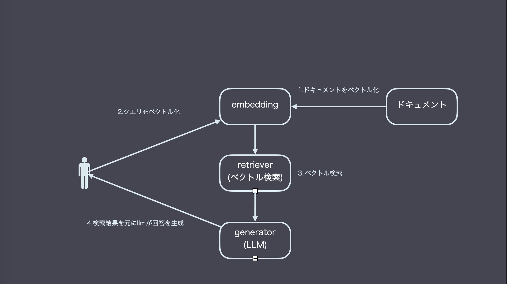
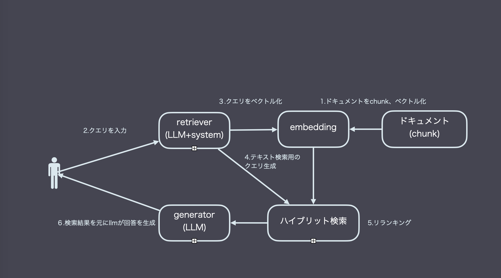

<!-- _class: lead -->
# RAG入門

---
# RAGが生まれた理由
- LLMは学習時の知識と、プロンプトで与えられた情報しか扱えない
- 未学習の社内データや最新情報を活用したい
- すべての情報を事前にプロンプトへ詰め込むのは不可能
- そこで、質問を検索クエリにして文書を取得し、コンテキストに追加する発想がRAG

---
# RAGの構成要素
<div class="grid grid-2">
  <div class="card">
    <h3><span class="chip">① Retrieve</span></h3>
    <ul>
      <li>データ検索</li>
      <ul>
        <li>ベクトル検索</li>
        <li>テキスト検索</li>
        <li>ハイブリッド検索</li>
      </ul>
    </ul>
  </div>
  <div class="card">
    <h3><span class="chip">② Generate</span></h3>
    <ul>
      <li>LLMで回答生成</li>
      <ul>
        <li>プロンプトエンジニアリング</li>
        <li>コンテキストエンジニアリング</li>
      </ul>
    </ul>
  </div>
</div>

---
# Embedding
- テキストを意味空間のベクトルに変換する仕組み
- 手法はいろいろ
  - 単語頻度などの統計的手法
  - 機械学習によるベクトル化
- 現在は機械学習（深層学習）が主流

---
# ベクトル検索
<div class="flow-blocks">
    <div class="flow-block">
        <span class="label">Step 1</span>
        文書をEmbedding
    </div>
    <div class="flow-block">
        <span class="label">Step 2</span>
        クエリをEmbedding
    </div>
    <div class="flow-block">
        <span class="label">Step 3</span>
        近傍文書を取得
    </div>
</div>

<ul class="content-bottom">
  <li>ベクトルが高次元ほど<span class="accent-2">精度↑／コスト↑</span></li>
  <li>step3のアルゴリズムは色々ある</li>
  <ul>
    <li>HNSW</li>
    <li>IVF</li>
  </ul>
</ul>

---
# 一番シンプルなRAG構成


---
# generatorのプロンプト例
```
関連する情報をもとに、質問に答えてください。

# 質問
{user_query}

# 関連情報
## document1
{document1}
## document2
{document2}
```

---
# なぜうまくいかないのか
- ドキュメントが長いと文脈が混在しやすい
- 混在した文脈は、ベクトル検索だけでは分離が難しい
  - AND、ORみたいな検索がベクトル検索は苦手
- 現実的な次元数では表現力が不足することが多い
  - 数学的に証明されている
 

---
# チャンキング
- ドキュメントを扱いやすいサイズに分割すること
  - 分割サイズ
  - どこで区切るか（段落/セクション）
- embeddingのベクトルの次元数も関係してくる
- 正解はなく、目的に合わせてチューニングが必要

---
# ハイブリッド検索
<div class="hybrid-slide">
  <div class="hybrid-stack">
    <div class="grid grid-2">
      <div class="card">
        <h3>ベクトル検索</h3>
        <ul>
          <li>意味の近さに強い</li>
          <li>表現ゆれに強い</li>
        </ul>
      </div>
      <div class="card">
        <h3>テキスト検索</h3>
        <ul>
          <li>キーワード一致に強い</li>
        </ul>
      </div>
    </div>
    <div class="merge-arrow">↓</div>
    <div class="card">
      <h3>ハイブリッド検索</h3>
      <div class="grid grid-2">
        <div>
          <ul>
            <li>ベクトル検索とテキスト検索を併用</li>
          </ul>
        </div>
        <div>
          <ul>
            <li>キーワードが含まれていて、内容も一致するものを取得</li>
          </ul>
        </div>
      </div>
    </div>
  </div>
</div>

---
# リランキング
- 異なる2つの検索結果をマージし、ソートする必要がある
- 代表的アルゴリズムはRRF
  - 両方で上位に来る文書を高く評価する発想
- AIにマージソートさせる手法もあるがコスト大

---
# ちょっと凝ったRAG構成


---
# 検索を整えてもなぜうまくいかないのか
- リランキングやハイブリッド検索でも改善しきれないことがある
- 元データの品質が重要
  - 古い・誤ったデータがあるとコンテキストが汚染される
  - LLMが混乱し、誤答につながる
- 検索のチューニングと同じくらいデータ整備が重要

---
# まとめ
<ul class="checklist">
  <li>RAGは検索で文脈を補う仕組み</li>
  <li>成功の鍵はチャンキングと検索・リランキングの最適化</li>
  <li>そして<strong>高品質な元データ</strong>が不可欠</li>
</ul>
